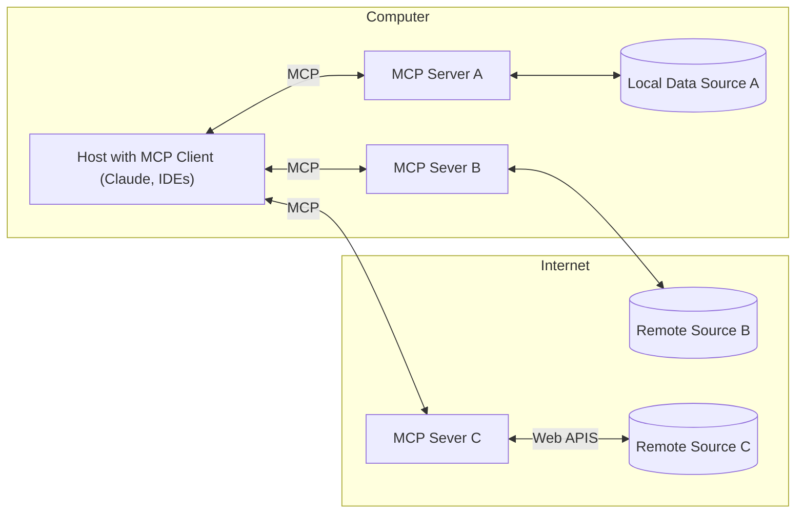
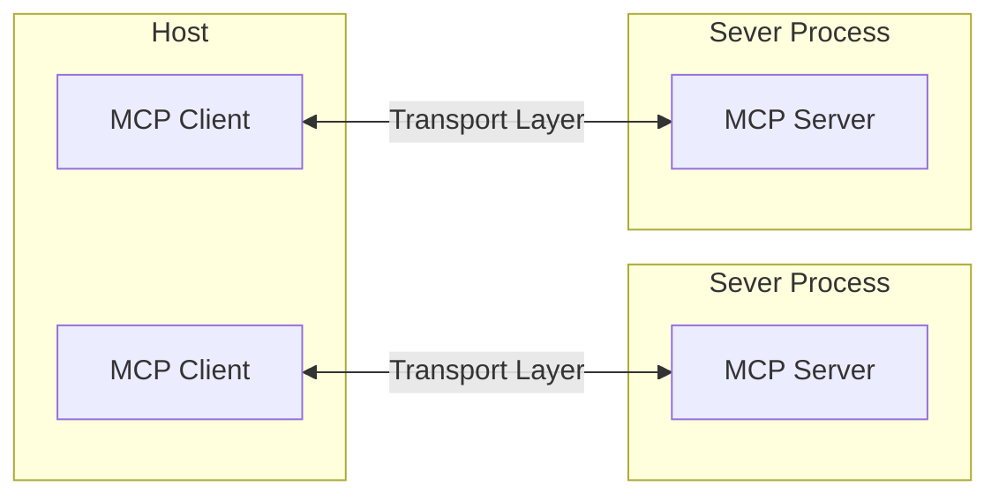
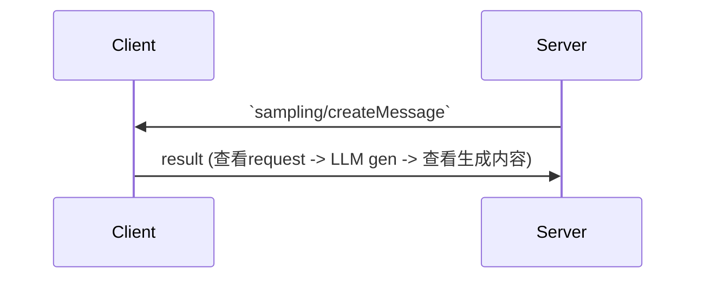

# MCP


> [Model Context Protocol](https://modelcontextprotocol.io/): Anthropic 2024年初提出的LLM unversial function call 接口

试图解决LLM provider或者用户去针对不同模型实现function call/tool use的重复问题 (实际上就是矛盾转移 转嫁给数据提供方)

## Quicktour

> MCP 的本质逻辑是: 提供一套模型交互原语 希望数据生产/存储方提供数据和功能接口 来增强大模型的能力

MCP 基础架构如下 分为

- Client: C/S=1:1
- Server: 提供数据访问接口
- Resource: 提供Server可用数据

三个部分 Host为持有Client的工具



这里对于各方的问题在于

Client

1. 需要足够强大的模型去理解新的工具
2. 需要手动管理/订阅不同的MCP server
3. 需要统一各家API

Server

1. 需要做好资源入口的管理
2. 需要做好工具能力的限制

## Concept

下面是MCP的几个重要概念

主要是server提供的功能

- Resources: server暴露出来的资源入口
- Prompts: server定义的prompt
- Tools

### Arch



MCP有两套基于 JSON-RPC 2.0 的传输机制 (JSON-RPC还挺古老的 2.0都是十年前了)

1. stdio transport: 适合本地进程
2. HTTP w SSE transport: 
    1. C→S: HTTP-POST
    2. S→C: Server-Sent Event (HTTP 1.1 长链接下的无缓存文本流 **text/event-stream**)

数据一共有下面四类

- Request (期待回复)
- Result (successed response)
- Error (failed response)
- Notification (单向消息)

Server 提供的功能

- Resources: 给模型用的上下文和数据
- Prompts
- Tools: function calls

> Client 可以提供 Sampling 的功能来让LLM多次交互

- Connection
    
    ```mermaid
    sequenceDiagram
    	Client->>Server: 初始化 request
    	Server->>Client: 初始化 response
    	Client->>Server: 初始化 notification
    	Note over Client,Server: 数据传输
    
    ```
    

### Resources

application-controlled

- 资源地址通过 URI 提供
- 资源类型分为 UTF-8 文本 和 二进制资源
- 资源发现方式有下面两种

```tsx
// API: resources/list
{
	// 1. 直接资源 给出 URI
  uri: string;           // Unique identifier for the resource
  // 2. 资源模板 给出 URI 模板 可以填入参数
  uriTemplate: string;   // URI template following RFC 6570

  // 下面是公共字段
  name: string;          // Human-readable name
  description?: string;  // Optional description
  mimeType?: string;     // Optional MIME type
}
```

资源通过 `/resources/read` 读取

```tsx
{
  contents: [
    {
      uri: string;        // The URI of the resource
      mimeType?: string;  // Optional MIME type

      // One of:
      text?: string;      // For text resources
      blob?: string;      // For binary resources (base64 encoded)
    }
  ]
}
```

### Prompts

user-controlled

跟资源差不多 可以理解为获取server预定义的带参数文本

### Tools

model-controlled

- Discovery: `tools/list`
- Invocation: `tools/call`
- Flexibility

工具的定义如下

```tsx
{
  name: string;          // Unique identifier for the tool
  description?: string;  // Human-readable description
  inputSchema: {         // JSON Schema for the tool's parameters
    type: "object",
    properties: { ... }  // Tool-specific parameters
  },
  // 下面几个东西并不独立 当 readOnlyHint=false 时
  // destructiveHint 和 idempotentHint 才有意义
  annotations?: {        // Optional hints about tool behavior
    title?: string;      // Human-readable title for the tool
    readOnlyHint?: boolean;    // If true, the tool does not modify its environment
    destructiveHint?: boolean; // If true, the tool may perform destructive updates
    idempotentHint?: boolean;  // (幂等性 即多次调用 效果一致) If true, repeated calls with same args have no additional effect
    openWorldHint?: boolean;   // If true, tool interacts with external entities
  }
}
```

### Sampling

唯一server发起的功能



这里会有一些server发来的模型相关设置

### Roots

> MCP 官网给的应用 只有 [fast-agent](https://github.com/evalstate/fast-agent) 和 Copilot 实现了这个功能

就是MCP server 提供的uri

```json
{
  "roots": [
    {
      "uri": "file:///home/user/projects/frontend",
      "name": "Frontend Repository"
    },
    {
      "uri": "https://api.example.com/v1",
      "name": "API Endpoint"
    }
  ]
}
```

## Example

下面用 ollama qwen3 来实现一个MCP系统样例

### server

这里的几个部分看起来都比较直观 都是通过装饰器定义资源和功能 没有什么难度

不过比较奇怪的是本地server并不需要自己起 是由host进行管理

```python
# server.py
from contextlib import asynccontextmanager

from mcp.server.fastmcp import FastMCP, prompts, Context

# region manage freature
@asynccontextmanager
async def mcp_lifespan(server: FastMCP):
    print("MCP.onStart")
    resource = "The lifetime resource"
    yield resource
    print("MCP.onStop")

# endregion manage freature

# Create an MCP server
mcp = FastMCP("Demo", lifespan=mcp_lifespan)

# region resource
@mcp.resource("config://app")
def get_config() -> str:
    """Static configuration data"""
    return "App configuration here"

@mcp.resource("greeting://{name}")
def get_greeting(name: str) -> str:
    """Get a personalized greeting"""
    return f"Hello, {name}!"

# endregion resource

# region prompt
@mcp.prompt()
def review_code(code: str) -> str:
    return f"Please review this code:\n\n{code}"

@mcp.prompt()
def debug_error(error: str) -> list[prompts.base.Message]:
    return [
        prompts.base.UserMessage("I'm seeing this error:"),
        prompts.base.UserMessage(error),
        prompts.base.AssistantMessage(
            "I'll help debug that. What have you tried so far?"
        ),
    ]

# endregion prompt

# region tool
@mcp.tool()
def add(a: int, b: int) -> int:
    """Add two numbers"""
    return a + b

@mcp.tool()
def calculate_bmi(weight_kg: float, height_m: float) -> float:
    """Calculate BMI given weight in kg and height in meters"""
    return weight_kg / (height_m**2)

@mcp.tool()
def get_lifespan(ctx:Context) -> str:
    return ctx.request_context.lifespan_context.resource
# endregion tool

if __name__ == "__main__":
    mcp.run() # <-- 默认使用stdio
```

### client

这里client的代码会更复杂一点 需要管理server 还需要LLM调用 这里借用 [anjor/ollama-mcp-client](https://github.com/anjor/ollama-mcp-client/blob/main/src/clients/ollama_client.py) 的 OllamaClient 实现

主要实现是三个函数
- `connect_to_server`: 连接server 初始化
- `process_query`: 调用LLM 并根据生成内容看看需要资源获取和function call
- `chat_loop`: CLI

```python
# /// script
# requires-python = ">=3.10"
# dependencies = [ollama, mcp]
# ///
from typing import Optional
from contextlib import AsyncExitStack
import asyncio
import sys

from mcp import ClientSession, StdioServerParameters
from mcp.client.stdio import stdio_client
from mcp.client.sse import sse_client
from ollama import Client

class OllamaMCPClient:
    def __init__(self, model_name: str="qwen3"):
        self.session: Optional[ClientSession] = None
        self.exit_stack = AsyncExitStack()

        self.client = Client()
        self.model_name = model_name
        self.tools = []

    async def connect_to_server(self, server_script_path: str):
        """Connect to an MCP server

        Args:
            server_script_path: Path to the server script (.py or .js)
        """
        is_python = server_script_path.endswith('.py')
        is_js = server_script_path.endswith('.js')
        if not (is_python or is_js):
            url = server_script_path
            client = sse_client(url)
        else:
            command = "python" if is_python else "node"
            server_params = StdioServerParameters(
                command=command,
                args=[server_script_path],
                env=None
            )
            client = stdio_client(server_params)
        

        # stdio_transport = await self.exit_stack.enter_async_context(stdio_client(server_params))
        tranport = await self.exit_stack.enter_async_context(client)
        # self.stdio, self.write = stdio_transport
        self.stdio, self.write = tranport
        self.session = await self.exit_stack.enter_async_context(ClientSession(self.stdio, self.write))

        await self.session.initialize()

        # List available tools
        response = await self.session.list_tools()
        self.tools = [{
                    "type": "function",
                    "function": {
                        "name": tool.name,
                        "description": tool.description,
                        "parameters": tool.inputSchema
                    },
                } for tool in response.tools]
        print("\nConnected to server with tools:", [tool["function"]["name"] for tool in self.tools])

    async def process_query(self, query: str) -> str:
        """Process a query using LLM and available tools"""
        messages = [
            {
                "role": "user",
                "content": query
            }
        ]

        response = self.client.chat(
            model=self.model_name,
            messages=messages,
            tools=self.tools,
        )

        # Process response and handle tool calls
        tool_results = []
        final_text = []

        if response.message.content:
            final_text.append(response.message.content)
        elif response.message.tool_calls:
            for tool in response.message.tool_calls:
                tool_name = tool.function.name
                tool_args = tool.function.arguments

                # Execute tool call
                result = await self.session.call_tool(tool_name, dict(tool_args))
                tool_results.append({"call": tool_name, "result": result})
                final_text.append(f"[Calling tool {tool_name} with args {tool_args}]")

                # Continue conversation with tool results
                messages.append({
                    "role": "user",
                    "content": result.content[0].text
                })

                response = self.client.chat(
                    model=self.model_name,
                    messages=messages,
                )

                final_text.append(response.message.content)

        return "\n".join(final_text)

    async def chat_loop(self):
        """Run an interactive chat loop"""
        print("\nMCP Client Started!")
        print("Type your queries or 'quit' to exit.")

        while True:
            try:
                query = input("\nQuery: ").strip()

                if query.lower() == 'quit':
                    break

                response = await self.process_query(query)
                print("\n" + response)

            except Exception as e:
                print(f"\nError: {str(e)}")

    async def cleanup(self):
        """Clean up resources"""
        await self.exit_stack.aclose()

async def main():
    if len(sys.argv) < 2:
        print("Usage: python client.py <path_to_server_script>")
        sys.exit(1)
        
    client = OllamaMCPClient()
    try:
        await client.connect_to_server(sys.argv[1])
        await client.chat_loop()
    finally:
        await client.cleanup()

if __name__ == "__main__":
    asyncio.run(main())
```

启动

```bash
# 1. 本地服务
uv run client.py server.py

# 2. 远程服务
uv run client.py https://docs.mcp.cloudflare.com/sse

# 3. 不使用 uv
pip install ollama "mcp[cli]"
python client.py server.py
python client.py https://docs.mcp.cloudflare.com/sse
```
